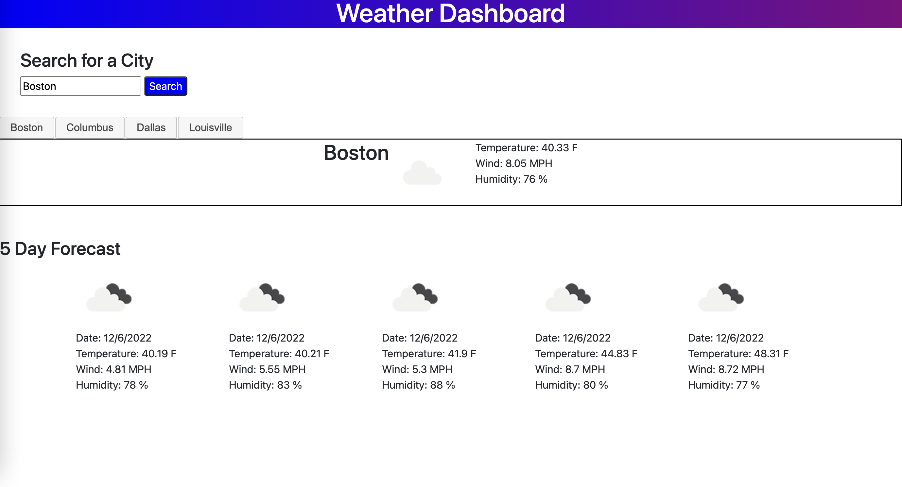

# weather_dashboard

## Description

This is a weather dashboard creater from HTML, CSS, and JavaScript. It utilizes the Open Weather Map API to pull in weather data for a specified city including current temperature, wind speed, and humidity. It also provides the user with a 5 day forecast. 

## Installation

N/A

## Usage

The weather dashboard allows a user to access current weather data and a 5 day forecast for a given city. It also saves recent location searches to the screen to allow the user to easily access previous searches and retreive the weather data for that given city. 

[Weather Dashboard](https://annaperlack.github.io/weather_dashboard/)

## Credits

N/A

## License

N/A